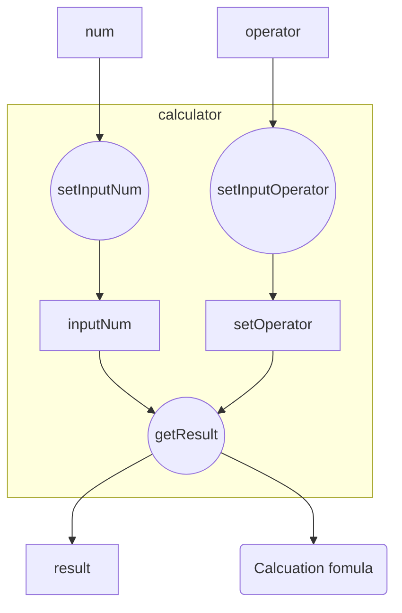

# AndroidCalculator

## 숫자

> tag에 데이터를 저장해 받는다.

## 연산자

| 연산자 | 메소드이름            | 하는일    |
| ------ | --------------------- | --------- |
| %      | percentBtnClick       | 1/100 * x |
| CE     | allClearBtnClick      |           |
| C      | clearBtnClick         |           |
| delete | deleteLastNumBtnClick |           |
| 1/x    | reverseNumBtnClick    | 1/x       |
| x^2    | squareNumBtnClick     |           |
| x^-2   | squareRootNumBtnClick |           |
| ÷      | divide                |           |
| ＋     | plus                  |           |
| －     | minus                 |           |
| ×      | multiply              |           |
| ＝     | equal                 |           |
| ±      | multiplyMinus         |           |

